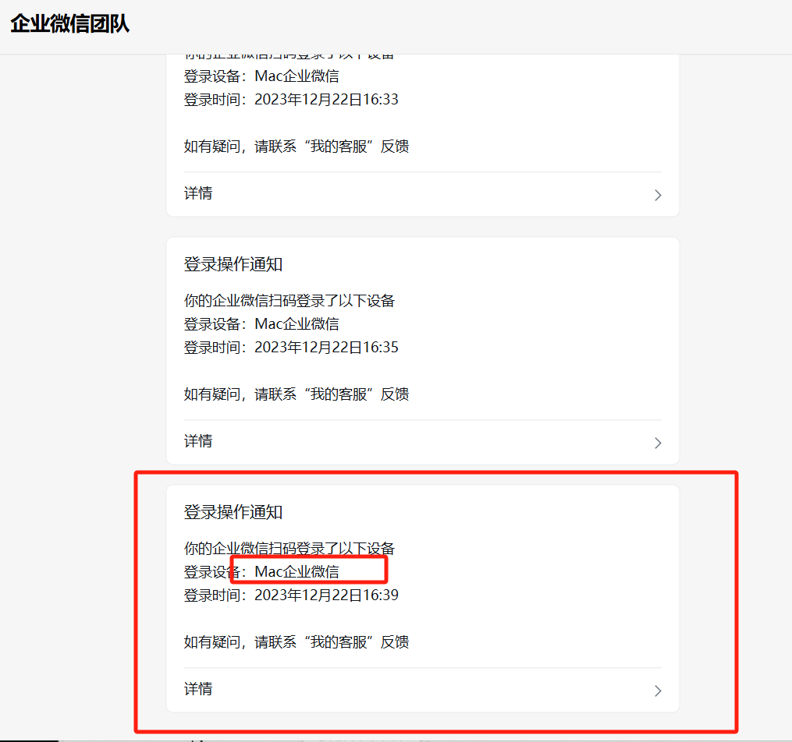

# Dify-Enterprise-WeChat-bot
基于Dify的企业微信知识库机器人
基于12月5日企微发布最新企业微信发布的的4.1.13.6002版本外部群的微信机器人支持语音功能私聊，

基于企业微信外部群的微信机器人，支持FASTgpt 重要的事情说三遍， 运行脚本请退出梯子 运行脚本请退出梯子 运行脚本请退出梯子 企业微信安装好4.0.8.6027版本取消更新 企业微信安装好4.0.8.6027版本取消更新 企业微信安装好4.0.8.6027版本取消更新
### 🌟 近期更新亮点：
2023/12/28 -新增mac方式登录，正常走pc扫码登录手机端显示mac登录，大幅降低风险

### 🌟 更新亮点：
*
* 智能回复优化：我们改进了AI算法，现在机器人能更准确地理解并回应您的问题。
* 增强的白名单功能：现在您可以更灵活地设置群聊和私聊的白名单，确保重要的交流不受限制。
* 聊天记录功能：我们新增了自动记录聊天内容到文件的功能，方便您随时查阅历史信息。
* 用户界面改进：为了更好的用户体验，我们对机器人的界面进行了一些微调。
* 性能提升：我们优化了代码，提高了机器人的响应速度和稳定性。
* 
企业微信机器人使用教程：
1.打开项目下载最新企业微信发布的的4.1.13.6002版本 下载：https://dldir1.qq.com/wework/work_weixin/WeCom_4.1.13.6002.exe
#  这是一个使用Dify API和企业微信（WeWork）的聊天机器人的实现，其功能包括：
##
上下文管理：通过Dify API和企业微信的上下文管理功能，机器人能够理解并维护与用户的聊天上下文。这意味着在同一会话中的连续消息可以共享上下文，允许聊天机器人理解和回应更复杂的问题。

用户独立会话管理：聊天机器人在企业微信群聊中为每个用户维护单独的会话记录，让机器人能更好地理解和回应每个用户的问题。

新旧用户会话处理：对于新用户，每次他们提问时，都会为他们创建一个新的会话。对于老用户，如果他们在私聊或群聊中提问，系统会使用他们之前的会话ID，保证上下文的连续性。

群聊@消息回复：在群聊中，机器人能够回复@它的消息，并在回复中@用户，让用户能够清楚地看到机器人的回答。

配置灵活：用户可以通过配置文件自由设置是否启用上下文管理，以及选择会话类型（每个消息都是新的会话，还是启用会话管理），以实现更灵活和个性化的机器人行为。

通过以上功能，这个聊天机器人能够提供具有上下文理解能力的智能对话服务，能够处理来自不同用户的私人聊天和群聊，适应不同的聊天场景和需求。

## 快速开始

**1.打开dify官网登录进去**

**2.创建自己的应用**

**3.选择对话型应用**

**3.点击构建好应用页面的api访问**

**4.生成自己应用key**

**打开项目的配置文件填写自己的dify的key**

**运行项目的的app软件**

## Dify企微机器人项目交流群**

