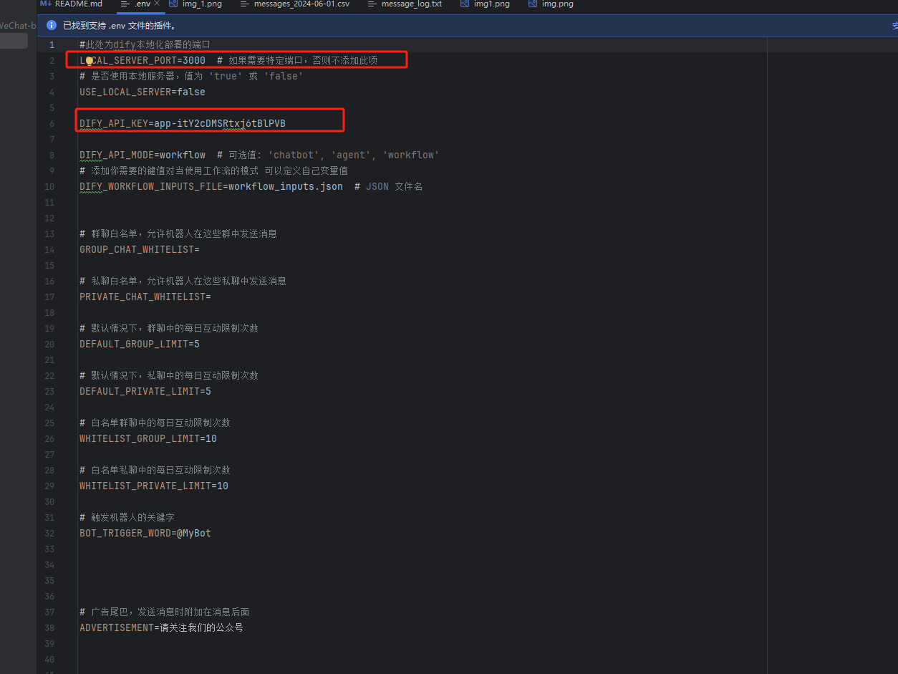

# Dify-企微机器人

## Dify-Enterprise-WeChat-bot

## 📌 介绍

欢迎来到 **Dify-企业微信机器人** 仓库！这是一个专为企业微信设计的知识库聊天机器人，利用 Dify API 增强其功能。兼容企业微信最新版本 4.1.13.6009，特别是针对外部群组的新功能。

🔗 [下载企业微信 4.1.13.6009](https://dldir1.qq.com/wework/work_weixin/WeCom_4.1.22.6009.exe)

**需要注意的是**

- 由于企业微信在版本中的 API 变更频繁, 为了保证本项目可用, 需要下载如上链接中的固定版本,否则可能会导致本项目中的一些核心功能失效,如识别会话
- 本项目对于 Dify 版本无特别要求

## ✨ 核心功能

- **上下文管理**：借助 Dify API，实现聊天上下文的维护，使机器人可以无缝处理复杂对话。
- **独立会话管理**：为企业微信群聊中的每个用户维护独立的会话，实现个性化互动。
- **智能回复**：通过改进的 AI 算法，提供更准确的响应，增强用户体验。
- **聊天记录功能**：自动记录聊天内容，方便回顾与进一步的 AI 训练。
- **配置灵活性**：用户可以通过配置文件自定义机器人的行为，如上下文管理和会话处理。
- **持续优化**：定期推出新功能和性能优化，不断提升机器人的表现。

## 赞助支持

如果您觉得这个项目对您有帮助，欢迎打赏以支持我们的工作：

您的赞助将用于：

- **维护和更新**：确保项目持续更新和维护，修复 Bug 并引入新功能。
- **服务器和基础设施**：支付服务器和相关基础设施的费用，确保 Bot 的高可用性和响应速度。
- **社区支持**：创建和维护文档、教程以及用户支持，帮助更多人使用和贡献本项目。

<div align="center">
  
</div>

## 联系我们

如需进一步交流和支持，欢迎扫描下方二维码添加微信进群：

<p align="center">
  
</p>

## 🚀 最近更新

## 更新日志

## [V1.0.07-beta.1] - 2025-03-14

## dify 本版本即将更新以下功能如需快速体验可先点击下方项目进行抢先体验 NextFlow-APP 版本

# NextFlow-APP V1.0.07-beta.1 更新说明

https://github.com/luolin-ai/Enterprise-WeChat-GPTbot/releases/tag/1.0.07-beta.1


## 主要更新：

- 修复无法发送签名图片
- 修复返回为空的回复
- 优化 [http://127.0.0.1:8001/docs](http://127.0.0.1:8001/docs) 文档
- 修复部分 API 无法使用
- 新增文件发送群组 API，也可私发文件
- 兼容 [https://nextflow.app/](https://nextflow.app/) 新请求格式，可在 https://nextflow.app/ 中管理企业微信的消息对应用户昵称 ID
  
  -- 修复回复两次问题

- 优化广告小尾巴格式

### 2024/05/20

- 废除原有版本，采用官网最新版本，新版沿用 win 方式登录，大幅降低风险，目前测试有半年安全无风险。
- 新增私有化部署本地 Dify 对接企微。可配置值：
  - `true`：连接到本地部署的 Dify 服务，适用于本地开发和测试。
  - `false`：连接到 Dify 官网服务，适用于生产环境或当本地服务器不可用时。

### 2024/04/27

- ~~PAD 协议登录~~：新的登录协议，显著降低安全风险。
- **完全兼容**：支持最新的 Dify 工作流程和 API。
- **聊天记录输出**：优化输出格式，支持数据的二次训练。
- **上下文关联**：强化与 Dify 后台的数据关联，实现高效的会话管理。

## 🔜 即将推出的功能

- 语音转文本及语音识别功能
- Dify 图像识别和文件发送功能
- 自动基于用户对话进行知识库训练，实现机器人的自我学习和迭代
- 批量添加好友功能

也可以通过微信给我们留言"扣子"获取更多信息。

## 🛠️ 安装和配置

### 配置 Dify Key

1. 创建一个 `.env` 文件，并添加您的 Dify Key：

   ```bash
   echo "YOUR_DIFY_KEY_HERE" > .env
   ```

### 快速开始

1. **打开 Dify 官网并登录**

   

2. **创建自己的应用**

   

3. **选择对话型应用**

   

4. **生成自己的应用 Key**

   

5. **打开项目的配置文件填写自己的 Dify Key**
   项目配置文件的位置

```
本地项目目录位置/Dify-Enterprise-WeChat-bot/.env
```

 

6. **运行项目的 app 软件**
   **项目启动方式**
   因企业微信特殊性, 只支持 windows 系统运行此项目
   首先双击运行如下程序

```
本地项目目录位置/Dify-Enterprise-WeChat-bot/dify_helper.exe
```

使用手机企业微信扫码打开电脑版企业微信
在电脑端输入手机企业微信中的六位验证码
登录成功,可以使用账号测试


## 使用 Dify Workflow 工作流模式

因 workflow 的特殊性, 暂未开发完毕, 开发完毕时将完善此处教程

## 目前已知问题

在成功运行本项目之后, 再次修改 dify 内容,dify 智能体重新发布后, 本项目不会随之更新, 即使重新开启本项目也不会更新
**解决方法:** 关闭本项目, 重新创建一个新的 dify 智能体, 更新本项目的 API_key 为新的 dify 智能体的 API_key, 并重新开启本项目

## 会话以文件形式长期保存

本程序可以以文件的形式长期保存企业微信中 AI 与用户的对话
文件以日期为区分,每日的文件保存在一个 csv 格式文件中
csv 文件保存位置

```
本地项目目录位置/Dify-Enterprise-WeChat-bot/messages_{{YYYY-MM-DD}}.csv
```

### 文件格式

Group ID: 企业微信群聊 ID
Group Name: "Private Chat"含义是这一条是私聊, "群聊"含义是这一条是群聊
Sender ID: 发送者,记录的是发送者的 wx_id
Sender Nickname: 发送者在企业微信上的昵称
Message: 记录双方发送的信息
Timestamp: 记录发送信息的时间,格式为{{YYYY/MM/DD HH:mm}}

**需要注意的是**
本地保存的会话只作为会话留存, 不会自动作为 AI 会话的知识库的数据支持

## 关于群里提问和 log 位置

在群里沟通的时候, 如遇到问题, 最好先看下 log 内容, 对于常见问题, 可以通过自行百度解决
如无法解决, 请在群里提问的同时附上 log 内容
log 存放位置

```
本地项目目录位置/Dify-Enterprise-WeChat-bot/messages_{{YYYY-MM-DD}}
```

## 💬 Dify 企微机器人项目交流群

添加小助手入群加微信备注 Dify

# 扫码入交流群（备注来源）


